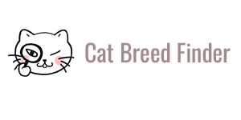

<p align="center">
  
</p>

----

# Cat Breed Finder 🐱
Cat Breed Finder is a simple website that allows you to explore and search among different cat breeds using the public [TheCatAPI](https://thecatapi.com/). The project offers a friendly and accessible experience for cat lovers, enabling them to discover characteristics, images, and relevant data about each breed.

This project was developed for personal and educational purposes and uses Vite as a modern development environment to enhance development speed and experience. Additionally, it allows secure integration of an API key through environment variables, facilitating connection to TheCatAPI without exposing sensitive credentials in the source code.
## Features
* Search cat breeds by name.
* Autocomplete suggestions while typing.
* View images, descriptions, and key characteristics of each breed.
* Responsive design (mobile and desktop friendly).
## ⭐ Demo ⭐
## Technologies Used
* HTML5
* CSS3
* Bootstrap
* JavaScript
* Vite
## Design Tools
* Adobe Photoshop (for the logo)
* Figma (for prototyping the website design)
## Installation
```
1. Clone this repository: 
#git clone https://github.com/your_username/your_repository.git
#cd your_repository
2. Install the dependencies:
#npm install
3. Create a .env file in the root of the project to store your API key securely. Make sure .env is included in .gitignore to prevent uploading your key to the repository.
4. Run the development server with Vite:
#npm run dev
```

## Credits
* Content and images provided by [TheCatAPI](https://thecatapi.com/).
* Web design and development project by lesliepita.
## License
This project is for personal and educational use only, with no commercial purpose.

---
---
---
# Cat Breed Finder (Buscador de razas de gatos)🐱
Cat Breed Finder es una web sencilla que te permite explorar y buscar entre diferentes razas de gatos utilizando la API pública de [TheCatAPI](https://thecatapi.com/). El proyecto ofrece una experiencia amigable y accesible para los amantes de los gatos, permitiéndoles descubrir características, imágenes y datos relevantes sobre cada raza.

Este proyecto fue desarrollado con fines personales y educativos, y utiliza Vite como entorno de desarrollo moderno para mejorar la velocidad y experiencia de desarrollo. Además, permite la integración segura de una API key a través de variables de entorno, facilitando la conexión con TheCatAPI sin exponer credenciales sensibles en el código fuente.
## Funcionalidades 
* Búsqueda de razas de gatos por nombre.
* Autocompletado con sugerencias mientras escribes.
* Visualización de imágenes, descripciones y características de cada raza.
* Diseño responsive (adaptado para móvil y escritorio).
## ⭐ Demo ⭐
## Tecnologías utilizadas 
* HTML5
* CSS3
* Bootstrap
* JavaScript
* Vite
## Herramientas de diseño
* Adobe Photoshop (para el logo)
* Figma (para el prototipado del diseño de la web)
## Instalación
```
1. Clona este repositorio:
#git clone https://github.com/tu_usuario/tu_repositorio.git
#cd tu_repositorio
2. Instala las dependencias:
#npm install
3. Crea un archivo .env en la raíz del proyecto para almacenar tu clave API de forma segura. Asegúrate de que .env esté incluido en .gitignore para evitar subir tu clave al repositorio.
4. Ejecuta el servidor de desarrollo con Vite:
#npm run dev
```
## Créditos
* Contenido e imágenes proporcionadas por [TheCatAPI](https://thecatapi.com/).
* Proyecto de diseño y desarrollo web por lesliepita.
## Licencia
Este proyecto es para uso personal y educativo, sin fines comerciales.

---
